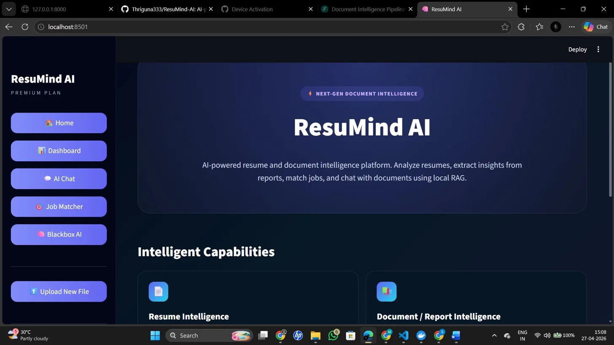
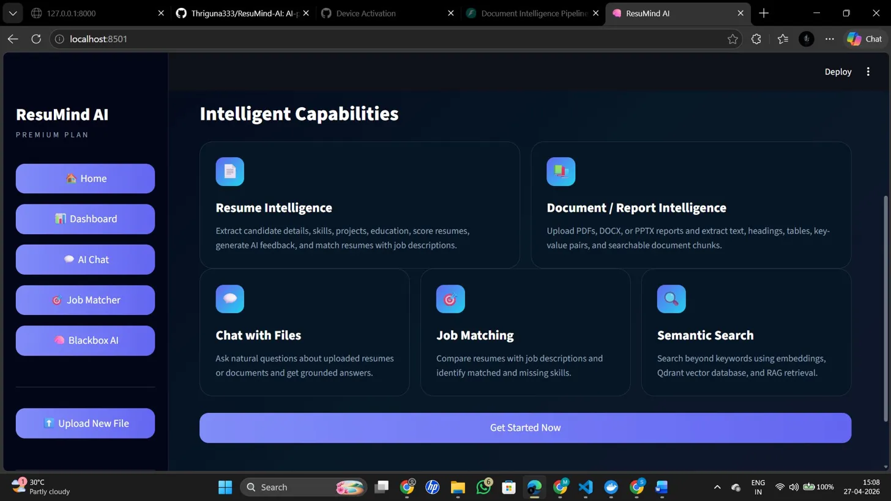
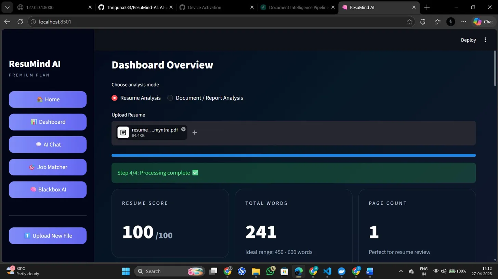
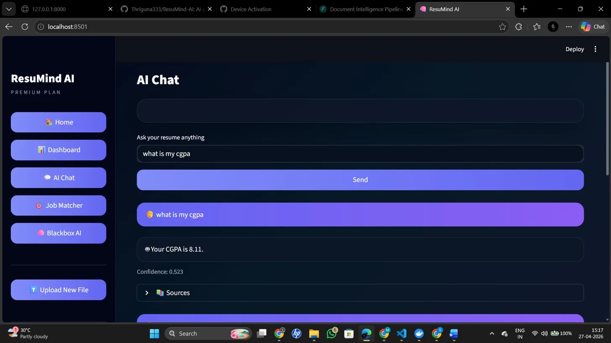
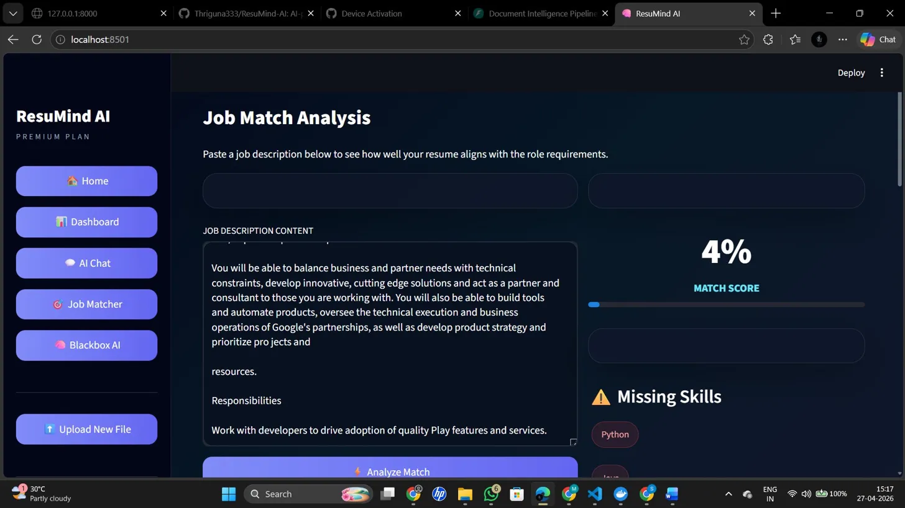
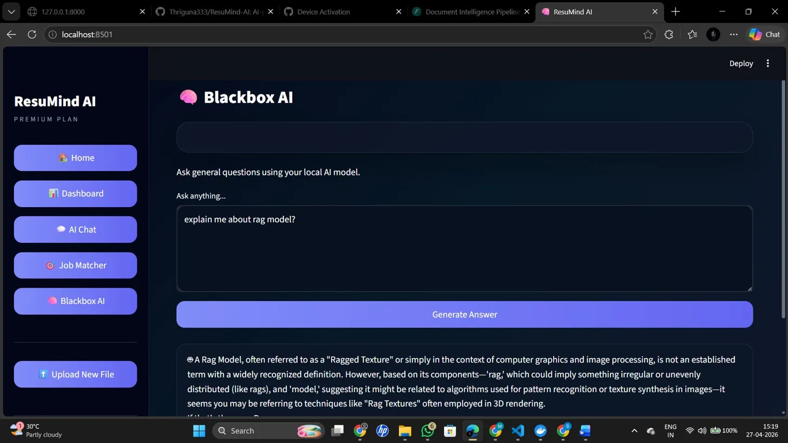

<div align="center">



# 🧠 ResuMind AI

### AI-powered Resume & Document Intelligence Platform


**Analyze resumes · Extract insights · Chat with documents · Match jobs · All locally**

[🚀 Live Demo](https://your-streamlit-url.streamlit.app) &nbsp;|&nbsp; [📄 Project Report](./ResuMind_AI_Report.pdf) &nbsp;|&nbsp; [⭐ Star this repo](https://github.com/Thriguna333/ResuMind-AI)

</div>

---

## 📸 Screenshots

<table>
  <tr>
    <td><br/><b>🏠 Home Page</b></td>
    <td><br/><b>✨ Intelligent Capabilities</b></td>
  </tr>
  <tr>
    <td><br/><b>📊 Resume Dashboard</b></td>
    <td><br/><b>💬 AI Chat with Citations</b></td>
  </tr>
  <tr>
    <td><br/><b>🎯 Job Match Analyzer</b></td>
    <td><br/><b>🧠 Blackbox AI Assistant</b></td>
  </tr>
</table>

---

## 🚀 Features

| Feature | Description |
|---|---|
| 📄 **Resume Parsing** | Extracts name, email, phone, skills, education, projects from PDF/DOCX/PPTX |
| 📊 **Resume Score** | AI-based scoring (0-100) with strengths and improvement suggestions |
| 🤖 **AI Recruiter Feedback** | Recruiter-style review using local LLM (phi3 via Ollama) |
| 🔍 **Semantic Search** | RAG pipeline with Qdrant vector DB + SentenceTransformers embeddings |
| 💬 **Chat with Resume** | Ask anything — answers with confidence score + source citations |
| 🎯 **Job Matching** | Compare resume vs job description, see matched/missing skills instantly |
| 🧠 **Blackbox AI** | General-purpose local AI assistant for any question |
| 📚 **Document Intelligence** | Extract text, headings, tables, key-value pairs from any document |

---

## 🛠 Tech Stack

| Layer | Technology | Purpose |
|---|---|---|
| Backend | FastAPI | REST API server |
| Frontend | Streamlit | Interactive dashboard UI |
| Vector Database | Qdrant | Embedding storage and retrieval |
| Embeddings | SentenceTransformers (all-MiniLM-L6-v2) | 384-dim semantic vectors |
| Local LLM | Ollama / phi3 | AI answers, feedback, Blackbox AI |
| NLP / NER | spaCy (en_core_web_sm) | Named entity recognition |
| PDF Parsing | PyMuPDF | Page + span level extraction |
| DOCX/PPTX | python-docx, python-pptx | Office format parsing |

---

## 🧩 System Architecture

---

## ▶️ Run Locally

### Prerequisites
- Python 3.10+
- Docker Desktop (for Qdrant)
- Ollama installed from [ollama.com](https://ollama.com)

### 1. Clone the repo
```bash
git clone https://github.com/Thriguna333/ResuMind-AI.git
cd ResuMind-AI
```

### 2. Start Qdrant
```bash
docker run -p 6333:6333 --name qdrant qdrant/qdrant
```

### 3. Pull LLM model
```bash
ollama pull phi3
```

### 4. Setup Python environment
```bash
cd backend
python -m venv venv
.\venv\Scripts\activate        # Windows
pip install -r ../requirements.txt
python -m spacy download en_core_web_sm
```

### 5. Start backend
```bash
python -m uvicorn main:app --reload
```

### 6. Start frontend (new terminal)
```bash
cd backend
..\venv\Scripts\activate
python -m streamlit run app_ui.py
```

Open → **http://localhost:8501**

---

## 📁 Project Structure

---

## 🎯 Use Cases

- **Job Seekers** — Get AI feedback on your resume before applying
- **Recruiters** — Quickly extract structured candidate data from resumes
- **Students** — Analyze project reports and research papers via chat
- **HR Teams** — Match candidates to job descriptions automatically

---

## 👨‍💻 Author

**Manikonda Sai Thriguna**
3rd Year B.Tech — Artificial Intelligence & Machine Learning

[](https://github.com/Thriguna333)
[](https://linkedin.com/in/sai-thriguna-manikonda)

---

<div align="center">

**⭐ If this project helped you, please give it a star!**

*Built with ❤️ using FastAPI · Streamlit · Qdrant · Ollama · spaCy*

</div>
